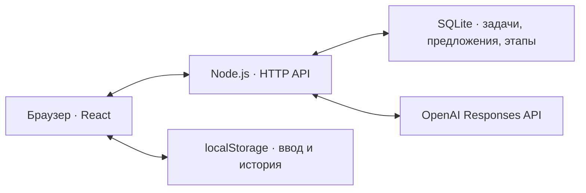

# AlemTask

## Краткое описание

**AlemTask** — локальный MVP платформы, на которой бизнес оформляет задачи для студенческих команд, получает предложения и подтверждает результаты работы.

Проблема: короткое описание идеи часто не объясняет, какие данные доступны, что нужно сделать и как проверить результат. Команде трудно оценить такую задачу и предложить подход. AlemTask помогает уточнить описание с помощью ИИ, собрать проверяемую карточку и показать её готовность по шкале от 0 до 100.

Две роли: **бизнес** формулирует задачу и принимает решения; **команда** предлагает решение и передаёт выполненные этапы. В текущей версии роли переключаются через демонстрационные профили без регистрации.

## Что реализовано

- Конструктор задачи: исходное описание → вопросы ИИ → редактируемая карточка → ручное подтверждение → публикация.
- Интеграция с OpenAI: извлечение известных фактов, вопросы по пробелам, история вопросов и ответов, защита ручных правок. При смене описания старые сведения ИИ отделяются от нового контекста и сохраняются в архиве формы.
- Рейтинг готовности с расшифровкой баллов и подсказками. Предварительный расчёт в редакторе отделён от подтверждённой версии в каталоге.
- Каталог с поиском, фильтрами по теме и готовности, сортировкой по рейтингу. Задачи с низким баллом также принимают отклики.
- Предложения команд: идея, план, срок и ссылка на прототип. Можно отправить несколько вариантов; бизнес вручную выбирает одну, несколько команд либо не выбирает ни одной.
- Этапы работы: выбранная команда отправляет описание и свидетельство результата. После подтверждения бизнесом начисляется **+10 баллов команде**; повторное подтверждение не дублирует награду.
- Сохранение задач, предложений и этапов в SQLite; сохранение ввода и истории конструктора в браузере. Светлый адаптивный интерфейс на русском языке.

### Как считается готовность

| Категория | Максимум | За что начисляются баллы |
|---|---:|---|
| Контекст и потребность | 20 | Контекст — 10, потребность — 10 |
| Данные и материалы | 20 | Содержательное описание доступных материалов |
| Ожидаемый результат | 15 | Заполнены тип и описание результата |
| Критерии успеха | 15 | Заполнены проверка/метрика и целевое условие |
| Ограничения | 10 | Указаны границы задачи |
| Пользователи | 10 | Указано, для кого создаётся решение |
| Связь с бизнесом | 10 | Контакт — 4, консультации — 3, обратная связь — 3 |
| **Итого** | **100** | |

Уровни: **0–39 — «Черновик»**, **40–69 — «Рабочая»**, **70–89 — «Готовая»**, **90–100 — «Приоритетная»**.

Баллы вычисляет код по заполненности полей; ИИ их не назначает. Пустые значения и распознаваемые заглушки вроде «не знаю» не дают баллов. Рейтинг отражает полноту описания, а не оценку бизнеса или гарантию качества проекта. Командные награды за этапы учитываются отдельно.

Для публикации нужны название, тема и подтверждение сведений. Минимального рейтинга нет. Неподтверждённые правки не меняют публичную карточку; подтверждённое удаление сведений может снизить её рейтинг.

## Как работает решение

1. Представитель бизнеса выбирает тему и описывает потребность обычными словами.
2. После нажатия «Уточнить с AI» сервер извлекает факты из описания, затем запрашивает вопросы о недостающих сведениях.
3. Бизнес отвечает на вопросы и нажимает «Сформировать карточку». Полученную карточку можно исправить вручную или продолжить уточнение кнопкой «Уточнить оставшееся».
4. Бизнес подтверждает сведения и публикует задачу. В каталоге появляется подтверждённая версия с её рейтингом.
5. Команда находит задачу и отправляет предложение с идеей, планом, сроком и ссылкой на прототип.
6. Бизнес рассматривает предложения и вручную выбирает участников.
7. Выбранная команда передаёт результат этапа. Бизнес проверяет его и подтверждает начисление баллов.

ИИ помогает подготовить описание. Подтверждение карточки, выбор команд и принятие этапов выполняет человек.

## Технологии

| Компонент | Технологии |
|---|---|
| Интерфейс | React 19, TypeScript, CSS, Lucide React |
| Сборка | Vite 6, плагин React, pnpm |
| Сервер | Node.js 24+, встроенный HTTP-сервер |
| Хранение | SQLite через встроенный модуль `node:sqlite`; `localStorage` в браузере |
| ИИ | OpenAI SDK 6, Responses API, структурированные JSON-ответы |
| Модель | В `.env.example` указана `gpt-4.1-mini`; выбирается серверной переменной `OPENAI_MODEL` |
| Проверка данных | Zod 3 |
| Тестирование | Встроенные `node:test` и `node:assert`, проверка типов TypeScript |

Точные разрешённые версии зависимостей закреплены в [pnpm-lock.yaml](pnpm-lock.yaml), команды — в [package.json](package.json).

## Архитектура проекта



Браузер обращается к локальному серверу. Сервер проверяет входные данные и правила выбранной демонстрационной роли, сохраняет изменения и выполняет запросы к OpenAI. API-ключ остаётся на сервере.

| Файл или каталог | Назначение |
|---|---|
| [src/App.tsx](src/App.tsx), [src/styles.css](src/styles.css) | Экраны, формы, переключение ролей и оформление |
| [shared/domain.ts](shared/domain.ts) | Формула рейтинга, уровни и сортировка |
| [shared/ai-session.ts](shared/ai-session.ts) | История вопросов, защита ручных полей и архив контекста |
| [shared/seed.ts](shared/seed.ts) | Начальные синтетические данные |
| [server/index.ts](server/index.ts) | HTTP API, выдача интерфейса, локальный доступ |
| [server/actions.ts](server/actions.ts) | Подтверждение, публикация, предложения, выбор команд и этапы |
| [server/store.ts](server/store.ts) | SQLite и транзакционное сохранение |
| [server/ai.ts](server/ai.ts) | Извлечение фактов, вопросы, проверка ответов и резервный режим |
| [prompts/](prompts/) | Отдельные промпты извлечения фактов и уточняющих вопросов |
| [tests/](tests/), [scripts/](scripts/) | Автоматические проверки и команды проекта |

По умолчанию база находится в `.data/alemtask.sqlite`. Состояние MVP хранится JSON-снимком в одной записи SQLite; изменения выполняются в транзакции. Редактируемая и подтверждённая версии карточки хранятся отдельно.

## Установка и запуск

### 1. Подготовить окружение

Нужны **Node.js 24+** и **pnpm**. Откройте терминал в папке проекта, где находится `package.json`, и проверьте:

```shell
node --version
pnpm --version
```

### 2. Установить зависимости

```shell
pnpm install --frozen-lockfile
```

### 3. Настроить переменные окружения

Если `.env` ещё нет, создайте его из примера. Существующий файл с вашими настройками перезаписывать не нужно.

**PowerShell:**

```powershell
if (!(Test-Path .env)) { Copy-Item .env.example .env }
```

**macOS / Linux:**

```bash
[ -f .env ] || cp .env.example .env
```

Заполните файл локально:

```dotenv
OPENAI_API_KEY=your_api_key_here
OPENAI_MODEL=gpt-4.1-mini
AI_TIMEOUT_MS=45000
PORT=4317
```

| Переменная | Значение |
|---|---|
| `OPENAI_API_KEY` | Ваш ключ OpenAI с доступом к выбранной модели |
| `OPENAI_MODEL` | Модель для серверных запросов |
| `AI_TIMEOUT_MS` | Тайм-аут одного запроса в миллисекундах; пример — 45000 |
| `PORT` | Локальный порт; по умолчанию 4317 |

Для настоящего ИИ нужны интернет и доступный API. Без ключа основной сценарий можно пройти вручную; при ошибке ИИ интерфейс также предлагает явную кнопку «Продолжить в демо-режиме». Этот режим использует локальные правила.

`.env`, база, журналы, `node_modules` и временная компиляция исключены через [.gitignore](.gitignore). В репозиторий следует добавлять только пустой пример [.env.example](.env.example). После изменения серверных настроек перезапустите приложение.

### 4. Собрать и запустить

```shell
pnpm build
pnpm start
```

Откройте **[http://127.0.0.1:4317](http://127.0.0.1:4317)**. При первом запуске база автоматически заполняется демонстрационными данными. При последующих запусках изменения сохраняются. Для остановки сервера нажмите `Ctrl+C` в его терминале.

На Windows можно использовать [Start-AlemTask.cmd](Start-AlemTask.cmd) после установки зависимостей и настройки `.env`. Скрипт использует установленный Node или доступный комплект Node приложения Codex; интерфейс собирает, только если `dist/index.html` отсутствует.

### Другие команды

| Команда | Действие |
|---|---|
| `pnpm build` | Проверяет типы и собирает интерфейс в `dist/` |
| `pnpm start` | Компилирует сервер и запускает существующую сборку интерфейса |
| `pnpm dev` | Сначала собирает проект, затем запускает локальный предпросмотр без HMR |
| `pnpm dev:hmr` | Запускает Vite в режиме автоматического обновления |
| `pnpm test` | Компилирует и запускает автоматические тесты |
| `pnpm seed` | Заменяет содержимое базы начальным демонстрационным набором |

После изменения интерфейса выполните `pnpm build` и обновите страницу. Для изменений сервера нужен перезапуск. В режиме `pnpm dev` после правок перезапустите команду. В ограниченной Windows-среде `dev:hmr` может завершиться ошибкой доступа Vite/esbuild; используйте `pnpm dev`.

**`pnpm seed` удаляет текущие изменения базы.** Для обычной проверки жюри сброс не нужен. Он не очищает сохранённые формы и архив в браузере. Не запускайте два сервера на одном порту. Если меняете порт, учитывайте, что ссылки на демонстрационные прототипы в начальных данных используют 4317.

## Как проверить решение

### Сценарий для жюри

1. Выберите роль **«Бизнес»**, откройте каталог и нажмите **«Создать задачу»**. Выберите тему «Образование» и введите:

   > Учебный центр получает заявки на курсы через мессенджер. Два администратора вручную переносят их в таблицу и иногда теряют сообщения. Нужен веб-прототип с единым списком, поиском и сменой статуса. Есть CSV из 50 обезличенных учебных заявок. Срок — две недели, без интеграции с оплатой.

2. Нажмите **«Уточнить с AI»**. При рабочей интеграции появится надпись **«Ответ получен от OpenAI»**. ИИ должен использовать известные сведения и спросить о пробелах; точные формулировки зависят от ответа модели.
3. Ответьте на вопросы, затем нажмите **«Сформировать карточку»**. Для этого учебного примера можно задать проверку: найти 10 контрольных заявок не дольше чем за 30 секунд каждую; консультации — дважды в неделю; обратная связь — в течение рабочего дня. Это ввод демонстратора, а не сведения, которые ИИ должен придумать.
4. Проверьте и дополните карточку. Подтвердите сведения и опубликуйте. Убедитесь, что задача появилась в каталоге, а рейтинг объясняется заполненными категориями.
5. Переключитесь на команду **Orbit**, найдите задачу и нажмите **«Отправить предложение»**. Укажите идею, план, срок и ссылку [на демонстрационный прототип](http://127.0.0.1:4317/demo-prototype). Можно воспользоваться кнопкой заполнения примера, затем отдельно отправить форму.
6. Повторите отклик от команды **Data Qadam**. Вернитесь в роль бизнеса и выберите обе команды. Выбор второй должен сохранить выбор первой.
7. От выбранной команды откройте задачу и нажмите **«Передать результат этапа»**. Укажите, что это проверка механики демонстрации, добавьте описание и свидетельство. Вернитесь в бизнес-профиль и подтвердите этап: появится **+10 баллов**.
8. Обновите страницу и проверьте, что опубликованная карточка, предложения и подтверждённый этап сохранились.

Дополнительные проверки:

- В исходном каталоге задача «Очередь заявок учебного центра» имеет 20 баллов и доступна для отклика.
- Кнопка **«Заполнить демопример»** в конструкторе подставляет полную синтетическую карточку: после подтверждения она получает 100/100. Эта кнопка сама по себе не вызывает OpenAI.
- Измените карточку без подтверждения: публичная версия сохранит прежний текст. Подтверждение применит изменения и пересчитает рейтинг.
- Для проверки истории ответьте на часть вопросов, сформируйте карточку и нажмите **«Уточнить оставшееся»**. Указанные ответы должны учитываться в следующем раунде.

Проверить состояние сервера можно по [`/api/health`](http://127.0.0.1:4317/api/health), ИИ — по [`/api/ai/status`](http://127.0.0.1:4317/api/ai/status). `configured: true` означает наличие настроек; `lastSuccessAt` появляется после успешного запроса и сбрасывается при перезапуске серверного процесса.

### Автоматические проверки

```shell
pnpm test
pnpm build
```

В текущем наборе **44 теста**: формула рейтинга, версии карточек, публикация с низким баллом, права демонстрационных ролей, несколько выбранных команд, однократные награды, ошибки ИИ, история ответов и защита ручных правок. AI-тесты используют подставные ответы и не обращаются к платному API.

Результаты выполненных проверок зафиксированы в [VERIFICATION.md](VERIFICATION.md). Подготовленный сценарий демонстрации с текстами полей — в [DEMO.md](DEMO.md).

## Данные и интеграции

Начальный набор в [shared/seed.ts](shared/seed.ts) содержит **один бизнес-профиль, пять команд, пять исходных описаний, пять опубликованных задач и пять предложений**. Рейтинги задач: 20, 65, 80, 94 и 100. Все сведения синтетические; после работы с приложением количество записей может измениться.

Упоминания CSV в карточках описывают материалы учебных задач. Приложение не загружает и не анализирует эти файлы. Страница `/demo-prototype` — небольшой статический пример для проверки ссылки в предложении.

Единственная внешняя интеграция приложения — **OpenAI Responses API**:

- При анализе сначала извлекаются факты с цитатами, затем при необходимости отдельный запрос формирует вопросы. Формирование карточки использует один запрос извлечения.
- На сервер передаются описание, карточка и история пар «исходный вопрос — ответ». Запросы выполняются с `store: false`; история для следующих шагов передаётся приложением.
- Контактное поле исключается из запроса, известный контакт и email скрываются. Это не полная автоматическая анонимизация любого текста.
- Цитаты проверяются на наличие в переданных сведениях. Неподтверждённые предложения не добавляются в пустые поля; человек проверяет итоговую карточку.
- Тайм-ауты, ошибки доступа, лимиты и некорректные ответы отображаются в интерфейсе. Резервная локальная логика включается явным действием пользователя.

Обычные действия с каталогом, предложениями и этапами выполняются локально. Подключений к рабочим CRM, оплате, почте или оборудованию нет.

## Ограничения текущей версии

- Это локальный хакатонный MVP. Переключатель профилей демонстрирует роли; настоящая регистрация и производственная авторизация не реализованы.
- Сервер слушает только `127.0.0.1`. Удалённый многопользовательский доступ не настроен.
- SQLite хранит общее состояние в одной JSON-записи. Нет нормализованной схемы, системы миграций и подтверждённых нагрузочных характеристик.
- Рейтинг проверяет заполненность, а не достоверность, полезность или выполнимость задачи. Баллы готовности не являются оценкой жюри.
- ИИ может ошибаться. Проверка цитат и близких повторов вопросов не гарантирует смысловую точность каждого ответа. Перед публикацией нужна ручная проверка.
- Настоящий ИИ зависит от доступа к OpenAI, сети и лимитов проекта. Демо-режим работает по правилам и не заменяет языковую модель.
- История уточнений, несохранённый ввод и архив конструктора хранятся в конкретном браузере; между устройствами не синхронизируются. Сохранённые карточки находятся в базе сервера.
- Не реализованы загрузка файлов, уведомления, чат между участниками, интеграции с внешними бизнес-системами и проверка фактического выполнения работ за пределами ручного подтверждения.
- Интерфейс русскоязычный. Казахский текст можно вводить, но отдельного переключателя языка интерфейса нет.

## Deployed-версия

**Публичная deployed-версия не настроена.** Конфигурации публичного хостинга в проекте нет.

После запуска приложение доступно на компьютере, где работает сервер: **[http://127.0.0.1:4317](http://127.0.0.1:4317)**. Это локальный адрес; публикация исходного кода на GitHub сама по себе не сделает приложение доступным по этой ссылке другим людям.

